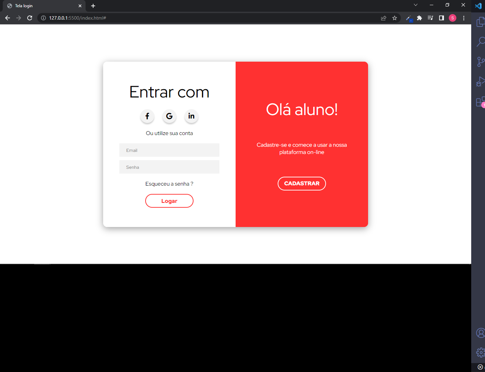
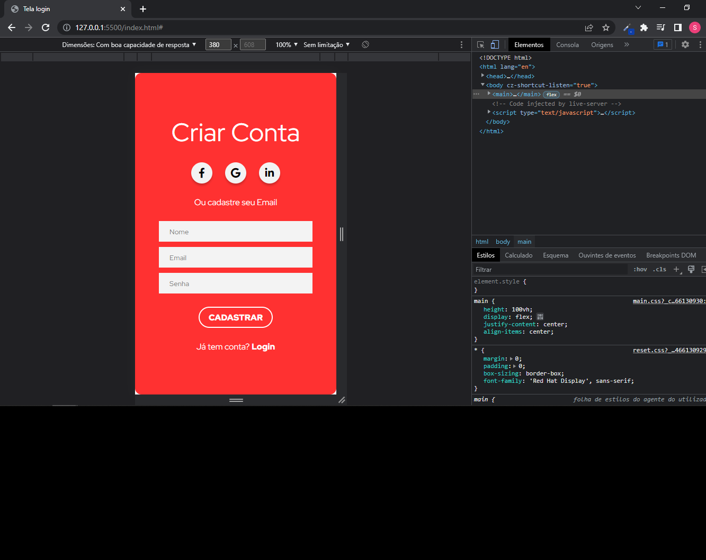

# estudosjs-partWeb
Estudos

# Criançao de minPage basico para praticar html, css, resposividade e  JavaScript

## tela desktop

## telaMobile

> Concluido estudo com html css e js.

Criando tela de login e registro com objetvo de praticar:

- [x] Criação do HTML
- [x] Criação do CSS
- [x] Criação resposividade para mobile
- [x] JavaScript
